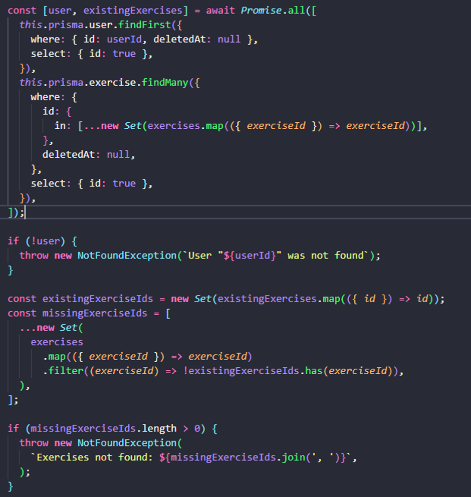
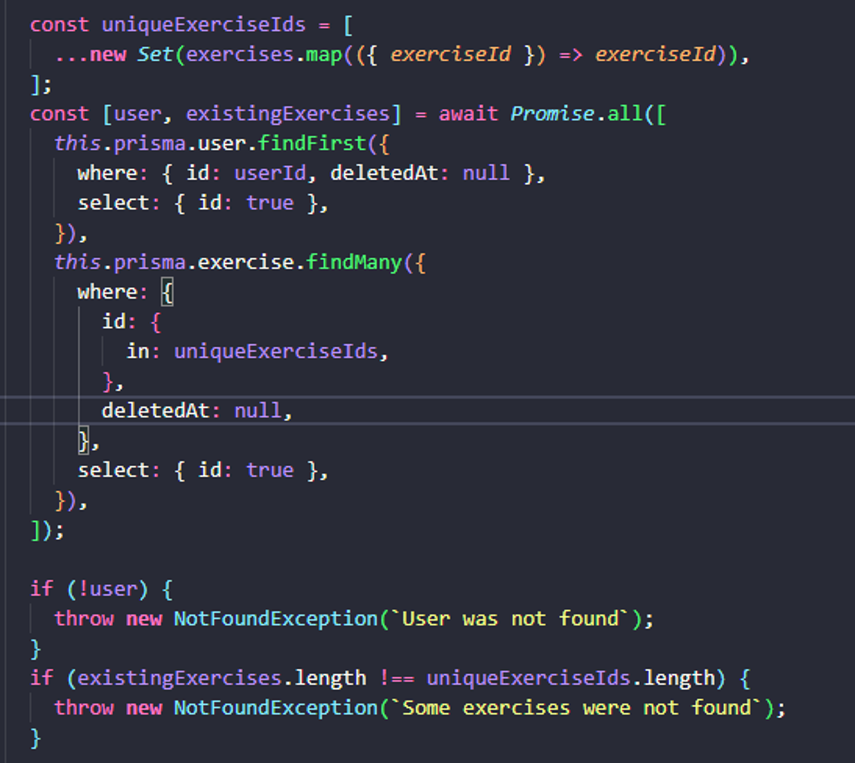
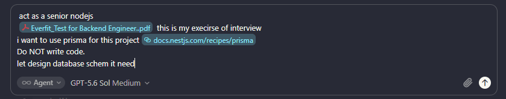
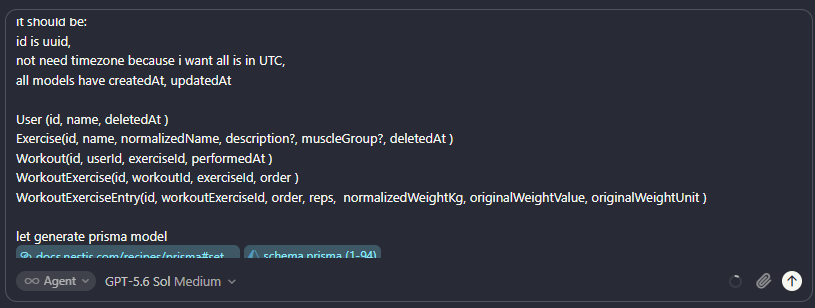
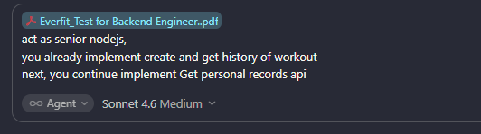

# AI Workflow Log

## Tools Used

| Tool | Purpose |
|------|---------|
| **Cursor (Claude Sonnet / GPT-5.6 Sol)** | Architecture design, code generation, debugging, documentation |
| **Cursor Agent** | Multi-step task execution — scaffolding NestJS modules, writing Prisma schema, implementing API endpoints, generating tests |
| **Cursor Chat** | Asking targeted questions, reviewing generated output, iterating on corrections |

---

## Examples Where AI Output Was Wrong or Suboptimal

### Example 1 — Overly Verbose Error Messages

**What happened:** When implementing validation logic (checking that exercises exist before creating a workout), the AI generated error messages that included full detail such as the user ID and a list of missing exercise IDs. This exposed internal data in the response and was more verbose than needed for a clean API.

**Before (AI-generated):**

The messages `` `User "${userId}" was not found` `` and `` `Exercises not found: ${missingExerciseIds.join(', ')}` `` leak internal IDs to the caller.

**After (corrected):**

I simplified them to generic, user-facing language: `User was not found` and `Some exercises were not found`. This keeps the API response clean without leaking implementation details.

---

### Example 2 — Database Schema with Poor Naming and Non-Essential Fields

**What happened:** The initial prompt asked the AI to design the database schema (with the requirements PDF and Prisma docs attached). The AI generated table and field names that did not match expected conventions and added fields that were not essential to the requirements.

**Initial prompt:**

**How I corrected it:** I reviewed the output, identified the issues, then provided explicit structured instructions specifying exactly what each model should contain, including cross-cutting rules (UUIDs, UTC timestamps, `createdAt`/`updatedAt` on all models).

**Correction prompt:**

With that corrected context, I asked the AI to regenerate the Prisma schema and the result matched expectations.

---

## Example Where I Rejected an AI Suggestion

**What happened:** When implementing the weight normalization logic (converting `originalWeightValue` + `originalWeightUnit` to `normalizedWeightKg`), the AI generated a standalone `WeightConversionService` class with its own module, provider, and injection to "follow best practices."

**Why I rejected it:** The conversion is a single pure formula used in one place. Creating a dedicated service class adds a module, a provider, and an injection just to wrap a few lines of math. I kept it as an inline calculation inside the service method — simpler, easier to read, and easier to review.

---

## Prompting Strategy

### 1. Always Provide Full Context Upfront

For every session I attached:
- The original requirements PDF so the AI understood the full scope
- Links to relevant documentation (NestJS docs, Prisma docs, Swagger setup guides) so the AI applied the correct patterns
- The specific source files that needed to be modified, so the AI edited in the right place rather than generating standalone snippets

### 2. Break the Requirement Into Small, Sequential Tasks

Rather than prompting "build the entire backend", I split the work into discrete steps that are easy to review and correct individually:

| Step | Task |
|------|------|
| S1 | Design the database schema |
| S2 | Configure Prisma (schema, migrations, client) |
| S3 | Implement the Create Workout API |
| S4 | Configure Swagger documentation for the API |
| S5 | Write unit and integration tests |
| S6 | Implement the Get Personal Records API *(example shown above — by this point the structure was established, so the prompt focused purely on the new business logic)* |
| ... | *(further steps continued in the same pattern for each remaining feature)* |

This approach made it easy to catch issues early (like the schema naming problem in S1) before they propagated into later steps.

### 3. Structured Prompt Format — Persona · Task · Context · Format

Every substantive prompt followed this widely-used pattern:

- **Persona** — Set the role so the AI applies the right level of expertise.
- **Task** — State clearly and concisely what needs to be done.
- **Context** — Provide the relevant background: requirements, constraints, existing code, and documentation links.
- **Format** — Specify how the output should be structured (e.g. NestJS service/controller pattern, follow existing code style).

**Example prompt from the project:**

The prompt opens with the persona ("act as senior nodejs"), attaches the requirements PDF as context, states the task concisely ("you already implement create and get history of workout, next implement Get personal records api"), and implies the expected format by pointing to the existing implementation.

This pattern keeps prompts focused and reduces the amount of back-and-forth needed to get usable output.
